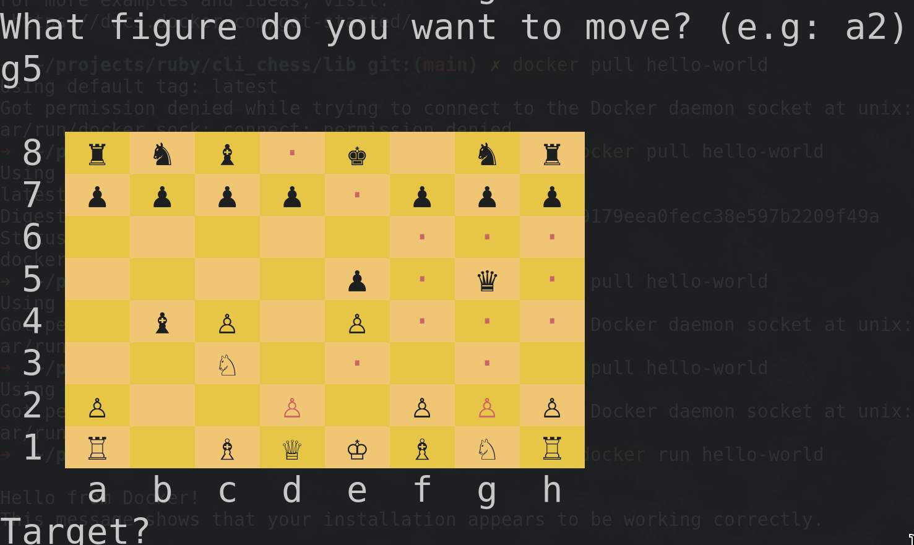

Basic CLI script to play Chess against another player!

Possible Improvements:
 - Singleplayer mode
 - Possible way to save the game finish later
 - implement castling
 - Implement pawns 'en passant' capture
 - Refactor code (..unite seperate classes for each figure)

Written because its part of the ruby curriciculum in "The Odin Project".
I didnt know anything about chess before, Odin made me learn the rules and im pretty glad they did!

Screenshot:

